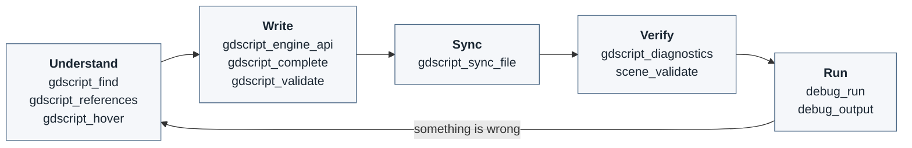
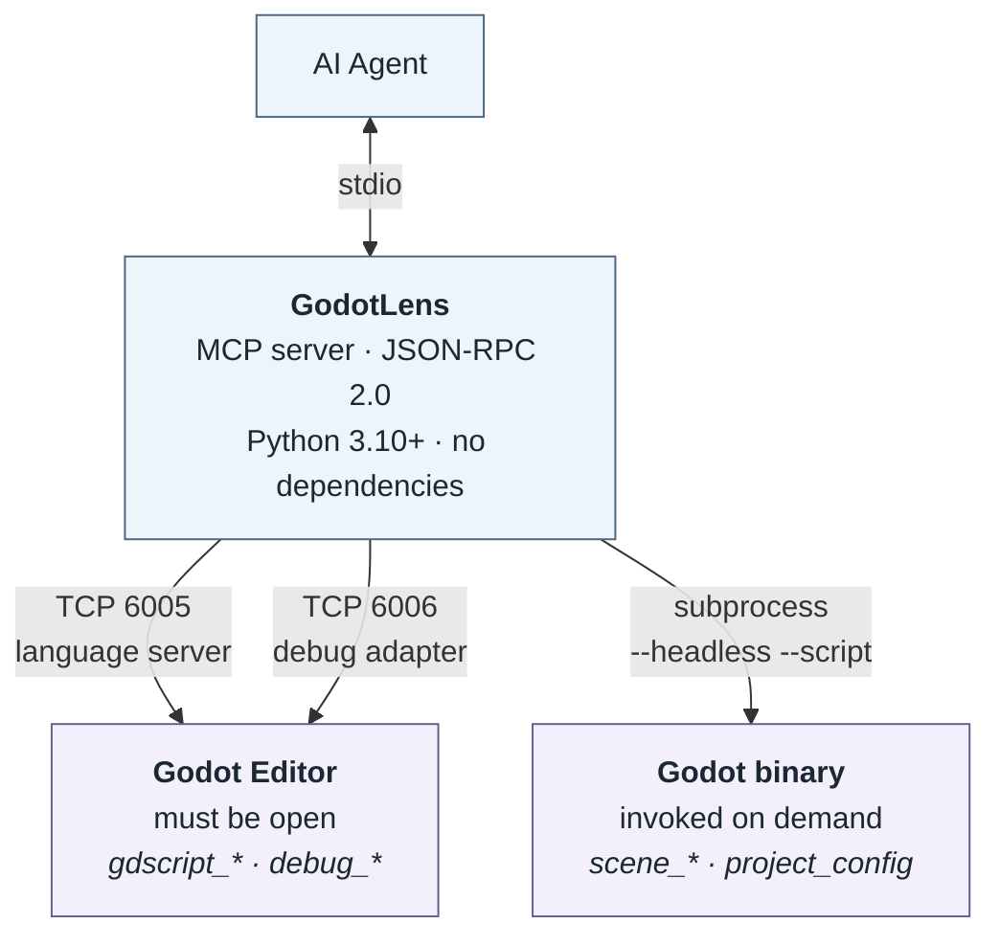

# GodotLens: Godot's own view of your GDScript project

[](https://github.com/pzalutski-pixel/godotlens-mcp/releases)
[](https://www.npmjs.com/package/godotlens-mcp)
[](https://pypi.org/project/godotlens-mcp/)
[](LICENSE)

An MCP server that lets an AI agent ask **Godot itself** about your project — where a symbol
is used, what a method's real signature is, whether an edit compiles, how a scene is wired,
and what the game actually printed when it ran.

## Why

An agent editing GDScript from text alone is guessing. It cannot tell a call from a comment,
cannot know which methods exist on a `CharacterBody2D` in *your* Godot version, cannot see that
a signal handler is wired by name inside a `.tscn`, and cannot see what happened at runtime.

GodotLens never answers those questions itself. It asks the engine and returns the engine's
answer. Measured on Godot 4.7.1, in a project where `take_damage` is defined in `player.gd`,
called twice from `enemy.gd`, once from `player.gd`, and named in a comment:

| Approach | Result |
|----------|--------|
| `grep take_damage` | 5 matches, including the comment |
| `gdscript_references` | exactly 4 real call sites; the comment is not among them |

That principle — *delegate every judgement to Godot* — is what makes the answers trustworthy,
and it is why the tool names tell you where an answer came from. `gdscript_*` is the language
server. `scene_*` and `project_config` run the engine. `debug_*` is the debugger.

## Requirements

| | Needed for |
|---|---|
| **Godot 4.6+** with your project open | everything — the language server and debug adapter live inside the editor |
| **Python 3.10+**, or **Node.js 16+** for `npx` | running this server |
| A Godot **binary** via `GODOT_BIN`, a `./godot/` directory, or `PATH` | `scene_*` and `project_config`, which invoke the engine |

Godot 4.6 is the floor because the language server changed materially at 4.5 (URI encoding)
and 4.6 (document ownership). Older versions are refused with a clear message rather than
silently misread.

The editor does not need a visible window — this is what CI uses:

```bash
godot --path <project> --editor --headless --lsp-port 6005 --dap-port 6006
```

## Install

**npx** (recommended). The package bundles the server; there are no runtime dependencies.

```json
{
  "mcpServers": {
    "godotlens": {
      "command": "npx",
      "args": ["-y", "godotlens-mcp"]
    }
  }
}
```

**pip**

```bash
pip install godotlens-mcp
```

```json
{
  "mcpServers": {
    "godotlens": { "command": "godotlens-mcp" }
  }
}
```

## The loop

The tools are designed around one cycle. Read it once and the rest of this document is a
reference.



1. **Understand.** `gdscript_find` locates a symbol by name; `gdscript_references` and
   `gdscript_hover` explain how it is used and what type it is.
2. **Write.** `gdscript_engine_api` gives real signatures instead of recalled ones,
   `gdscript_complete` offers scene-aware candidates, and `gdscript_validate` checks proposed
   content *before* it reaches disk.
3. **Sync.** Godot's language server does not watch the filesystem. After editing a `.gd`
   file, call `gdscript_sync_file` or it keeps answering from the old text.
4. **Verify.** `gdscript_diagnostics` for compile errors, `scene_validate` for the wiring the
   compiler cannot see.
5. **Run.** `debug_run` starts the game and returns what it printed.

Two conventions apply throughout:

- **All line and character parameters are 0-indexed**, matching the LSP. Editor line 1 is
  line 0. `gdscript_find` exists partly so you rarely have to compute one by hand.
- **Results carry a `verified` flag** where it matters. `verified: false` with an empty
  diagnostics list means Godot never reported back — that is *not* a clean bill of health.

## Tools

### Understanding code

| Tool | Description |
|------|-------------|
| `gdscript_find` | Locate a declaration **by name**. Returns a position the tools below accept directly. |
| `gdscript_definition` | Where a symbol is defined. |
| `gdscript_references` | Every reference project-wide. On 4.6+ this reparses every `.gd` file, so it is not cheap. |
| `gdscript_references_in_file` | Occurrences within one file. Much cheaper. Godot 4.7+. |
| `gdscript_hover` | Type information and documentation for a symbol. |
| `gdscript_symbols` | The symbol tree of a file. |
| `gdscript_signature_help` | Parameter info at a call site. |
| `gdscript_symbols_batch`, `gdscript_definitions_batch`, `gdscript_references_batch` | The same, across many files or positions in one call. |

### Writing code

| Tool | Description |
|------|-------------|
| `gdscript_engine_api` | Signatures and docs for an engine class or member, from the exact build in use. Use instead of recalling Godot's API. |
| `gdscript_complete` | Completions at a position. The only **scene-aware** query: includes real `$NodePath` entries and the signals actually on the owning node. |
| `gdscript_validate` | Check proposed content for errors **without writing it to disk**. |
| `gdscript_rename` | Rename a symbol. Refuses when Godot will not rename it, and warns when the name also appears in scene files it cannot update. |

### Keeping Godot in step

| Tool | Description |
|------|-------------|
| `gdscript_sync_file` | Sync one modified file and return its diagnostics. |
| `gdscript_sync_files` | Sync several at once. |
| `gdscript_release_file` | Release a file so the language server reads from disk again. |
| `gdscript_diagnostics` | Errors and warnings for one or more files. |
| `gdscript_status` | Connection check. Start here if anything behaves oddly. |

### Project and scenes

These invoke the Godot binary so scenes resolve exactly as the engine builds them, inherited
scenes included. They do not parse `.tscn` as text.

| Tool | Description |
|------|-------------|
| `project_config` | Autoload singletons, input action names, `class_name` globals, and the main scene, via `ProjectSettings`. |
| `scene_state` | Node tree, types, script attachments, `unique_name_in_owner` flags, exported values, and signal connections. |
| `scene_validate` | Checks every connection points at a method that exists. |

### Runtime

Godot serves a Debug Adapter Protocol server from the editor, no addon required. The language
server tells you whether code compiles; only the debugger tells you what it **did**.

| Tool | Description |
|------|-------------|
| `debug_run` | Run the project and return what it printed. |
| `debug_output` | Console output from a running game — `print`, stdout, stderr, and runtime errors with their source location. Drained on each call. |
| `debug_set_breakpoints` | Set breakpoints in a file. |
| `debug_stack_trace` | The call stack where execution is paused. Empty means not paused. |
| `debug_inspect` | Variables in a stack frame, by scope. |
| `debug_evaluate` | Evaluate an expression at a breakpoint, instead of adding `print` and re-running. |
| `debug_continue`, `debug_pause`, `debug_step_over` | Execution control. |
| `debug_terminate` | Stop the running game. |
| `debug_status` | Adapter connection and whether the game is running or paused. |

## What Godot cannot tell you

Worth knowing before you trust a result:

- **The language server reads `.gd` files only.** A signal handler wired in a `.tscn`
  `[connection]` block is invisible to it, so renaming that handler leaves the scene pointing
  at a method that no longer exists — and that fails at runtime with no compile error. This is
  why `scene_validate` exists and why `gdscript_rename` warns.
- **Autoload and input action names are bare strings.** `GameState.add_score(1)` and
  `Input.is_action_pressed("jump")` are validated by nothing at all. Check them against
  `project_config` before writing them.
- **`gdscript_references` is expensive on 4.6+**, reparsing every script in the project.
  Prefer `gdscript_references_in_file` when one file is enough.

## Architecture

Three mechanisms, one process. Each tool group maps to exactly one of them, which is how you
know where an answer came from.



The MCP and LSP/DAP protocols are implemented directly against the standard library, so the
package has **zero runtime dependencies** and the npm bundle is a handful of `.py` files.

## Configuration

| Variable | Default | Description |
|---|---|---|
| `GODOT_LSP_HOST` | `127.0.0.1` | Language server host |
| `GODOT_LSP_PORT` | `6005` | Language server port. The official VS Code extension uses `6008` |
| `GODOT_DAP_HOST` | `127.0.0.1` | Debug adapter host |
| `GODOT_DAP_PORT` | `6006` | Debug adapter port, used by `debug_*` |
| `GODOT_BIN` | auto | Godot executable, required by `scene_*` and `project_config` |
| `GODOT_PROJECT_ROOT` | auto | Project root; auto-detected by walking up for `project.godot` |
| `GODOT_LSP_TIMEOUT` | `15` | Seconds to wait for a single language server response |
| `GODOT_DIAGNOSTICS_TIMEOUT` | `8` | Seconds to wait for diagnostics after a sync |
| `GODOT_VERSION` | auto | Override capability detection |

## Contributing

```bash
pip install -e ".[dev]"
pytest -m "not integration"   # no Godot needed
ruff check .
```

Integration tests launch a real headless Godot and skip cleanly without one:

```bash
GODOT_BIN=/path/to/godot pytest -m integration
```

CI runs the suite on Linux, Windows and macOS across Python 3.10–3.13, runs the integration
tests against a real Godot on all three, and installs the built npm tarball and executes it.

## License

Apache License 2.0 — see [LICENSE](LICENSE) and [NOTICE](NOTICE).

<!-- mcp-name: io.github.pzalutski-pixel/godotlens -->
